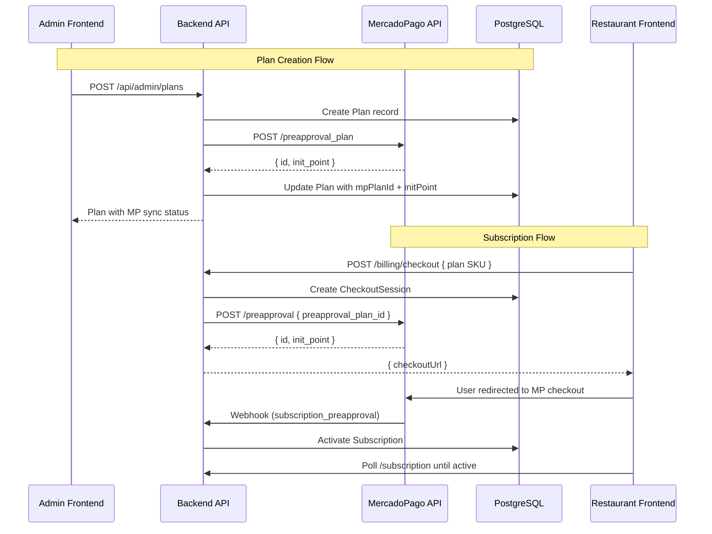

# MercadoPago Subscriptions Integration (PreApproval Plan)

This document describes the integration of MercadoPago's subscription system (PreApproval Plan) into SimpleReserva.

## Architecture Overview

## Environment Variables

The following variables are required in the backend `.env`:

- `MERCADOPAGO_ACCESS_TOKEN`: The seller's Access Token (Production or Test).
- `MP_PUBLIC_KEY`: The seller's Public Key.
- `BACKEND_PUBLIC_URL`: The public URL of the backend (e.g., ngrok URL for local testing).
- `MP_WEBHOOK_SECRET`: (Optional) Secret key to validate webhook signatures.
- `MERCADOPAGO_TEST_MODE`: Set to `true` when using test credentials.
- `MP_TEST_PAYER_EMAIL`: The email of the test buyer account.

## API Entities Mapping

| SimpleReserva Model | MercadoPago Entity | Description |
|---------------------|--------------------|-------------|
| `Plan` | `preapproval_plan` | Defines frequency, amount, and name of the subscription. |
| `Subscription` | `preapproval` | An instance of a user subscribed to a plan. |
| `PaymentReceipt` | `payment` | Individual charges generated by the subscription. |

## Plan Synchronization

Plans created in the Admin Panel are automatically synchronized with MercadoPago.

- **Creation**: When a plan is created, a `preapproval_plan` is created in MP.
- **Update**: When name, price, or frequency changes, the MP plan is updated.
- **Manual Sync**: Admins can manually sync a plan using the "Sincronizar" button.
- **Bulk Sync**: A "Sincronizar todos" button is available for initial migration.

The following fields are stored in the `Plan` model:
- `mercadopagoPreapprovalPlanId`: The ID of the plan in MP.
- `mercadopagoInitPoint`: The shareable link for the plan in MP.
- `mercadopagoLastSyncAt`: Timestamp of the last successful synchronization.

## Subscription Flow

1. **Checkout**: The restaurant owner selects a plan in the Billing page.
2. **PreApproval**: The backend creates a `preapproval` in MP, associated with the `preapproval_plan_id`.
3. **Redirect**: The user is redirected to the MP checkout URL.
4. **Payment**: The user completes the payment in MP.
5. **Webhook**: MP sends a `subscription_preapproval` event to the backend.
6. **Activation**: The backend activates the subscription in the database.
7. **Polling**: The frontend polls the subscription status until it becomes `active`.

## Webhook Handling

The webhook endpoint is `/api/webhooks/mercadopago`.

- **Event `subscription_preapproval`**:
    - `authorized` / `approved`: Activates the subscription.
    - `payment_required`: Enters grace period (7 days).
    - `cancelled` / `expired`: Deactivates the subscription.
- **Event `payment`**:
    - `approved`: Creates a `PaymentReceipt` in the database.

## Testing Guide

1. **Test Accounts**: Create a Seller and a Buyer account in the [MercadoPago Developer Panel](https://www.mercadopago.cl/developers/panel/app).
2. **Credentials**: Use the Seller's Access Token in the backend.
3. **Local Webhooks**: Use `ngrok` to expose your local server and set `BACKEND_PUBLIC_URL`.
4. **Payment**: Use the test credit cards provided by MercadoPago (e.g., `5031 7557 3453 0604`).
5. **Verification**: Check the "Suscripciones" section in the Seller's MercadoPago dashboard.

## Production Checklist

- [ ] Replace test credentials with Production Access Token and Public Key.
- [ ] Set `MERCADOPAGO_TEST_MODE=false`.
- [ ] Set `BACKEND_PUBLIC_URL` to the production API URL.
- [ ] Configure the Webhook URL in the MercadoPago Dashboard.
- [ ] Set `MP_WEBHOOK_SECRET` for signature validation.
- [ ] Ensure all plans are synchronized (check sync badges in Admin Panel).
- [ ] Perform an end-to-end test with a real payment.
